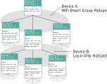

# Meshrabiya

Meshrabiya is a mesh network for Android that operates over WiFi. It allows applications
to seamlessly communicate over multiple hops and multiple WiFi direct and/or Local Only Hotspots.
Each device is given a "virtual" IP address (typically a random auto-generated address
e.g. 169.254.x.y). Applications can then use the provided SocketFactory and/or DatagramSocket class
to communicate with other nodes over multiple hops as if they were directly connected. This works
with various higher level networking libraries such as OkHttp.

It is intended for use in situations where multiple Android devices need to communicate with each 
other and a WiFi access point is not available e.g. schools and health clinics without WiFi 
infrastructure, when hiking, etc. WiFi enables high-speed connections with tests obtaining 300Mbps+.
Using multiple hops over multiple WiFi direct groups enables more devices to connect than is possible
using a single device hotspot.

Meshrabiya provides socket factories (for both TCP and UDP) that can create sockets to route data 
between nodes over multiple hops as if they were directly connected. The socket factory can also
be used with other networking libraries (e.g. OkHttp) to make it easy to send/receive data over the
virtual mesh.

How it works:

* Node A creates a hotspot using a [Wifi Direct Group](https://developer.android.com/reference/android/net/wifi/p2p/WifiP2pManager#createGroup(android.net.wifi.p2p.WifiP2pManager.Channel,%20android.net.wifi.p2p.WifiP2pManager.ActionListener)). 
  or [Local Only Hotspot](https://developer.android.com/guide/topics/connectivity/localonlyhotspot).
  It generates a "connect link" that includes the hotspot SSID, passphrase, ipv6 link local address
  (if a WiFi direct group), BSSID (where possible), and the service port number.
* Node B obtains the connect link by scanning a QR code (this could also potentially be discovered via
  Bluetooth Low Energy Advertising). Node B connects to the hotspot of 
  Node A using the [Wifi Bootstrap API](https://developer.android.com/guide/topics/connectivity/wifi-bootstrap). 
  If Node A created a WiFi direct group, then Node B will use the ipv6 link local address to reach Node 
  A. If Node A created a Local Only Hotspot, then Node B will use the DHCP server address to reach 
  Node A. Node B sends a UDP packet to the known address / service port of Node A to enable Node A 
  to discover Node B. Node A and Node B can now communicate. The connection is done using 
  [WifiNetworkSpecifier](https://developer.android.com/guide/topics/connectivity/wifi-bootstrap) on 
  Android 10+ and using WifiManager on prior versions. On Android 10+ the user will normally only see  
  a confirmation dialog the first time a connection is established between two nodes (except when 
  it is not possible for a single node to maintain the same SSID and/or when the BSSID is unknown).
* Node B creates its own hotspot. Node C (and so forth) can connect. All nodes periodically broadcast
  originator messages that include their virtual IP address and connect link. The propogation of
  originator messages is subject to limits on the maximum number of hops. When a node receives an
  originator message it knows the other node, and it knows the next hop if it wants to send traffic
  to that node. This is based on the [BATMAN Originator Message concept](https://www.open-mesh.org/doc/batman-adv/OGM.html).
* Each node can simultaneously operate both a hotspot for incoming connections and make one outgoing
  connection via its WiFi station (client). There are two possible ways to do this, each of which has
  some advantages and disadvantages:
 * __WiFi Direct Group__ Almost all Android devices (except it seems Android 11+ devices that support 
  [WiFi station - Access Point concurrency](https://developer.android.com/reference/android/net/wifi/WifiManager#isStaApConcurrencySupported())) 
  can create a WiFi direct group and
  simultaneously remain connected to a WiFi access point (as a station). Creating a WiFi direct 
  group creates a hotspot for "legacy devices" that operates a normal hotspot (and does not share 
  Internet). IPv6 link local must be used to avoid an IP conflict
  due to the fact that Android assigns the IP address 192.168.49.1 to all nodes that operate as a 
  WiFi direct group owner. We also use the link local IPv6 address to attempt to calculate the MAC Address, 
  which needs to be specified to avoid a user prompt each time a user reconnects. Using the link local
  address to calculate the MAC address avoids the need to use CompanionDeviceManager to discover the 
  Mac address (which requires using an intent result and results in users seeing two dialog boxes on 
  Android 10).
  It is possible to specify the hotspot SSID, passphrase and band (2.4Ghz or 5Ghz) on any Android 10+
  device.
 * __Local Only Hotspot__ This is supported on all Android 8 devices, however it can only operate
 concurrently with being connected to another hotspot if [WiFi station - Access Point concurrency](https://developer.android.com/reference/android/net/wifi/WifiManager#isStaApConcurrencySupported())
 is supported. This is only available on Android 11+ devices and requires hardware support. Generally
 lower-end devices are less likely to have this feature. Android generates a random subnet range so 
 there is no IP address conflict when one device is both operating as a Local Only Hotspot provider 
 and connected to another Local Only Hotspot at the same time. It is only possible to specify the 
 hotspot SSID, passphrase, and band on Android 13+ using a hidden API.

Want to try it yourself? Download the test app APK from [releases](https://github.com/UstadMobile/Meshrabiya/releases).

Want to collaborate on development? Join us on discord: [https://discord.gg/WHe35Sbsg4](https://discord.gg/WHe35Sbsg4).



## Getting started

Add repository to settings.gradle :
```
dependencyResolutionManagement {
    repositoriesMode.set(RepositoriesMode.FAIL_ON_PROJECT_REPOS)
    repositories {
      ...
      maven { url "https://devserver3.ustadmobile.com/maven2/" }
    }
}       
```

Add the dependency
```
implementation "com.github.UstadMobile.Meshrabiya:lib-meshrabiya:0.1-snapshot"
```

### Connect devices

Create a Virtual Node:

```
//Create a DataStore instance that Meshrabiya can use to remember networks etc.
val Context.dataStore: DataStore<Preferences> by preferencesDataStore(name = "meshr_settings")

val myNode = AndroidVirtualNode(
    appContext = applicationContext,
    dataStore = applicationContext.dataStore,
    //optionally - set address, network prefix length, etc.
)

```

Create a hotspot on one node:

```
myNode.setWifiHotspotEnabled(
  enabled = true,
  preferredBand = ConnectBand.BAND_5GHZ,
)

val connectLink = myNode.state.filter {
   it.connectUri != null
}.first()

```

Use the connect link to connect from another node:
```

val connectLink = ... //Get this from QR code scan etc.
val connectConfig = MeshrabiyaConnectLink.parseUri(connectLink).hotspotConfig
if(connectConfig != null) {
  myNode.connectAsStation(connectConfig)
}

```

### Exchange data using TCP

1. On the server side - create a normal server socket:
```
val serverVirtualAddr: InetAddress = myNode.address 
val serverSocket = ServerSocket(port)
```

2. On the client side - use the socket factory to create a socket
```
val socketFactory = myNode.socketFactory
val clientSocket = socketFactory.createSocket(serverVirtualAddr, port)
```

The Socket Factory uses a "socket chain" under the hood. It will lookup the next hop to reach the
given destination. It will then connect to the next hop and write its destination to socket stream,
similar to how an http proxy uses the host header. Each node runs a chain socket forwarding server. 
Once the next hop is the destination (e.g. it reaches a node that has a direct connection to the 
destination node), then the socket is connected to the destination port. See ChainSocketServer for
further details.

The Socket factory will fallback to using the system default socket factory for any destination that
is not on the virtual network (e.g where the ip address does not match the netmask of the virtual 
node). It is therefor possible to use the socket factory anywhere, even when connections to non-virtual
destinations are required - e.g. it can be used with an OKHttp Client and the client will be able to
connect to both virtual and non-virtual addresses.
e.g.
```
val okHttpClient: OkHttpClient = OkHttpClient.Builder()
            .socketFactory(myNode.socketFactory)
            .build()
```

### Exchange data using UDP

Create a DatagramSocket with a given port (or use 0 to get a random port assignment)
```
val datagramSocket = myNode.createBoundDatagramSocket(port)
```

The socket can be used the same as a normal DatagramSocket (e.g. by using send/receive), but it will 
send/receive ONLY over the virtual network. Broadcast packets are supported by setting the 
destination address to 255.255.255.255

### Known issues

Instrumented test debug: You must go to test settings, debug tab, and change to "java only" 
debugger type. Thank you, Google.
